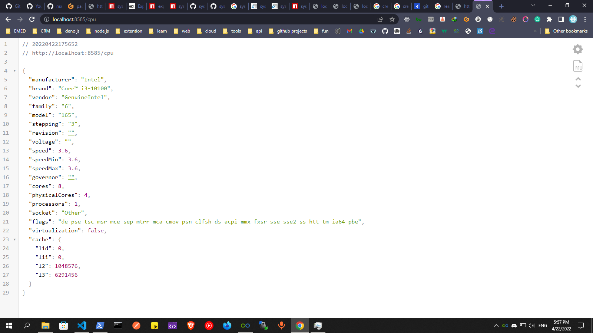

## simple api to get system informations

### `npm install`

To install all dependencies

### `npm start`

Runs the app in the development mode.\
Open [http://localhost:8585](http://localhost:8585) to view it in your browser.

 

